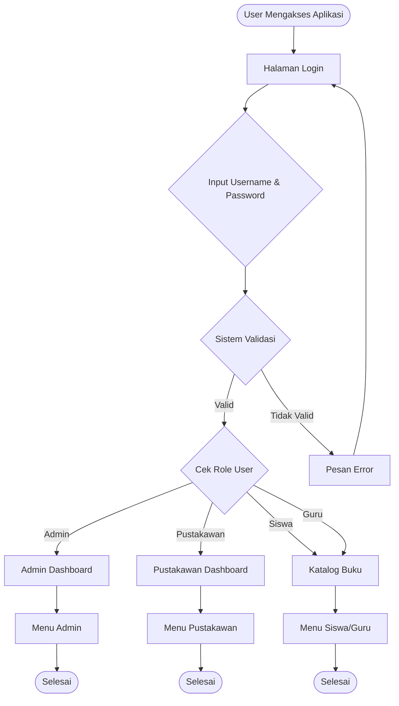
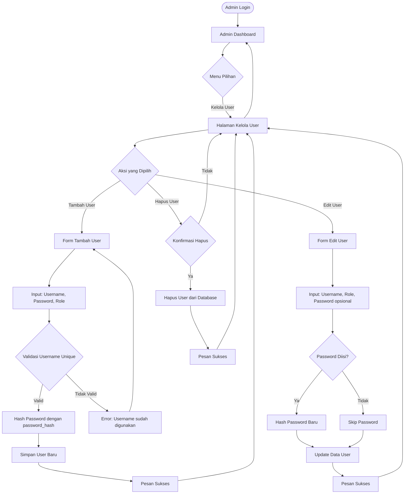
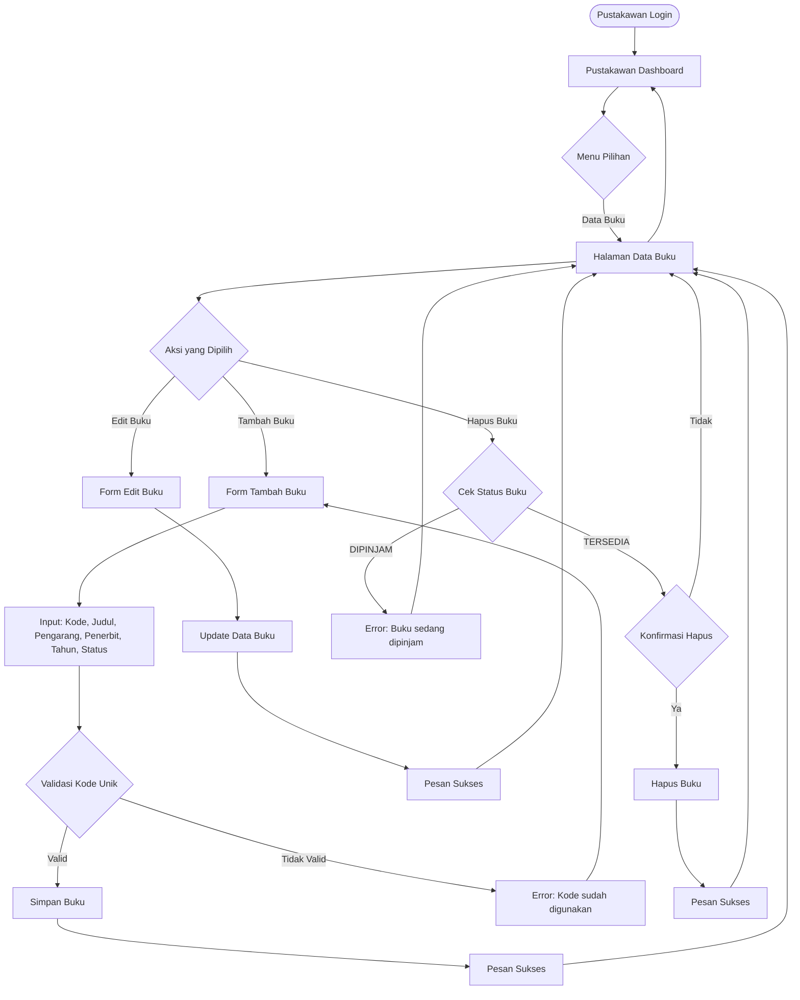
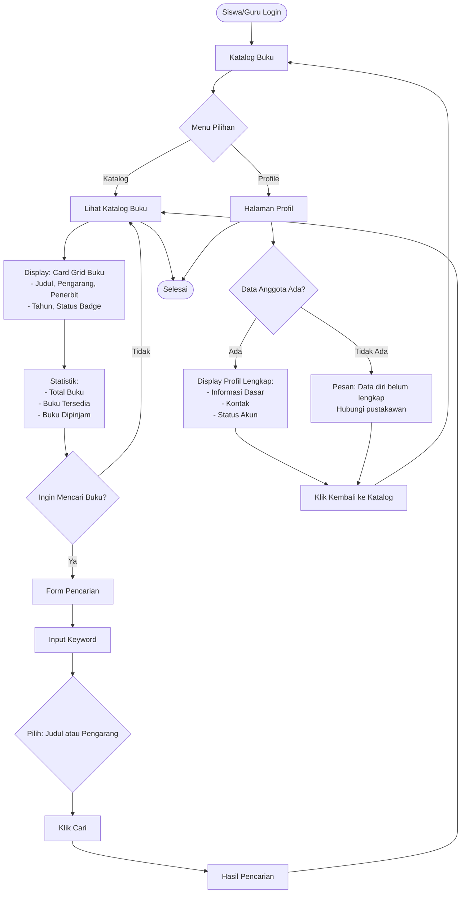
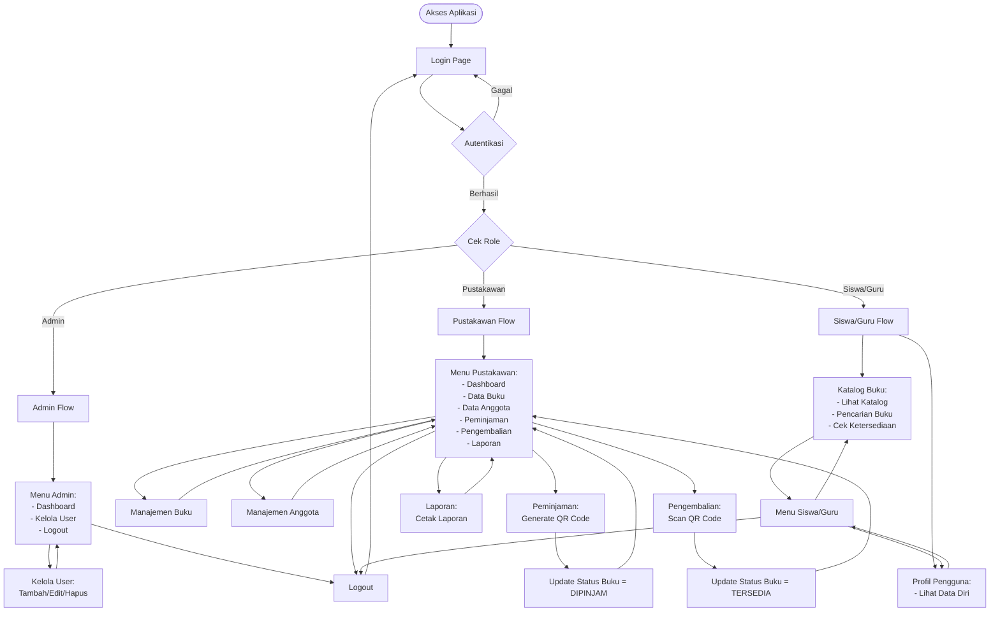

# Sistem Informasi Perpustakaan SMAN 1 Mandau (PHP Native)

Sistem Informasi Perpustakaan berbasis web yang dikembangkan menggunakan PHP Native (tanpa framework), MySQL, CSS, dan JavaScript. Sistem ini menggantikan proses manual perpustakaan menjadi terkomputerisasi, terstruktur, minim human error, dan user friendly.

## 📋 Daftar Isi

1. [Fitur Utama](#fitur-utama)
2. [Struktur Proyek](#struktur-proyek)
3. [Instalasi](#instalasi)
4. [Flow Bisnis Sistem](#flow-bisnis-sistem)
5. [Role & Hak Akses](#role--hak-akses)
6. [Panduan Pengujian](#panduan-pengujian)
7. [UI/UX Design & Color Scheme](#uiux-design--color-scheme)
8. [Keamanan & Autentikasi](#keamanan--autentikasi)
9. [Troubleshooting](#troubleshooting)
10. [Changelog](#changelog)

---

## 🎯 Fitur Utama

1. **Multi-Role Access:** Admin, Pustakawan, Siswa, dan Guru dengan hak akses berbeda
2. **Manajemen Data:** Kelola Pengguna, Anggota, dan Buku
3. **Data Diri Siswa & Guru:** Sistem menyediakan data diri lengkap untuk siswa dan guru (NIS/NIP, kelas/jurusan/mata pelajaran, kontak, dll) yang tersimpan terpisah dari data login
4. **Profil Pengguna:** Siswa dan guru dapat mengakses halaman profil untuk melihat data diri mereka
5. **Transaksi Peminjaman:** Mencatat peminjaman dan **Generate QR Code** untuk setiap transaksi
6. **Transaksi Pengembalian:** Memproses pengembalian dengan **Scan QR Code (Kamera)** atau Input Manual dan menghitung denda otomatis
7. **Katalog Online:** Siswa/Guru dapat melihat katalog, mencari buku, dan mengecek ketersediaan
8. **Laporan:** Laporan Peminjaman dan Pengembalian yang dapat dicetak

---

## 📁 Struktur Proyek

```
/perpustakaan
|
|-- config/
|   |-- database.php      (Konfigurasi koneksi DB & fungsi helper)
|   |-- functions.php     (Fungsi umum: sanitize, generate QR Code, denda)
|
|-- auth/
|   |-- login.php         (Halaman Login - semua role wajib login)
|   |-- logout.php        (Logout & destroy session)
|
|-- admin/
|   |-- dashboard.php     (Dashboard Admin dengan statistik)
|   |-- users.php         (CRUD Kelola User)
|
|-- pustakawan/
|   |-- dashboard.php     (Dashboard Pustakawan dengan statistik)
|   |-- buku.php          (CRUD Kelola Data Buku)
|   |-- anggota.php       (CRUD Kelola Data Anggota)
|   |-- peminjaman.php    (Transaksi Peminjaman & Generate QR Code)
|   |-- pengembalian.php  (Transaksi Pengembalian & Scan QR Code)
|   |-- laporan.php       (Laporan Peminjaman & Pengembalian + Cetak)
|
|-- katalog/
|   |-- index.php         (Katalog Buku untuk Siswa/Guru + Pencarian)
|
|-- assets/
|   |-- css/
|   |   |-- style.css     (Styling UI/UX: modern, sidebar, card, modal)
|   |-- js/
|   |   |-- script.js     (Interaksi Modal & UI)
|   |-- img/
|   |   |-- qr_codes/     (Folder penyimpanan QR Code yang di-generate)
|
|-- vendor/
|   |-- qrlib.php         (Library QR Code - entry point)
|   |-- qr*.php           (13 file library QR Code)
|   |-- cache/            (Cache folder untuk QR Code)
|
|-- index.php             (Redirect ke Login)
|-- db_perpustakaan.sql   (Skrip Database & Data Awal)
|-- README.md             (Dokumentasi ini)
```

---

## 🚀 Instalasi

### 1. Persiapan Lingkungan

**Persyaratan Sistem:**

- Web Server: Apache/Nginx
- PHP: 7.4+ (disarankan PHP 8.1+)
- MySQL/MariaDB: 5.7+
- Ekstensi PHP yang dibutuhkan:
  - `mysqli` (untuk koneksi database)
  - `gd` (untuk generate QR Code image)

**Cek Ekstensi PHP:**

```bash
php -m | grep -i mysqli
php -m | grep -i gd
```

### 2. Konfigurasi Database

**A. Buat Database:**

```sql
CREATE DATABASE perpustakaan_sman1mandau;
```

**B. Impor Skrip Database:**
Impor file `db_perpustakaan.sql` ke database yang sudah dibuat.

**C. Konfigurasi Koneksi:**
Edit file `config/database.php` dan sesuaikan konfigurasi:

```php
private $host = "localhost";
private $db_name = "perpustakaan_sman1mandau";
private $username = "root";      // Sesuaikan
private $password = "";          // Sesuaikan
```

### 3. Library QR Code

**Status:** Library PHP QR Code sudah terinstall di folder `vendor/`

Library yang digunakan: **PHP QR Code** (by Dominik Dzienia)

- File utama: `vendor/qrlib.php`
- Total 13 file library (qr\*.php)
- Folder cache: `vendor/cache/` (untuk optimize performance)

**Catatan:** Jika library belum terinstall, download dari:

- GitHub: https://github.com/t0k4rt/phpqrcode
- Copy semua file qr\*.php ke folder `vendor/`

### 4. Permission Folder

Pastikan folder berikut memiliki permission write:

- `assets/img/qr_codes/` (untuk menyimpan QR Code yang di-generate)
- `vendor/cache/` (untuk cache QR Code)

```bash
chmod 777 assets/img/qr_codes/
chmod 777 vendor/cache/
```

### 5. Akses Aplikasi

Akses aplikasi melalui browser:

```
http://localhost/perpustakaan/
```

Atau sesuaikan dengan path Anda:

```
http://localhost/perpustakaan_sman1mandau/perpustakaan/
```

---

## 📋 Data Diri Siswa & Guru

Sistem menyediakan data diri lengkap untuk siswa dan guru yang tersimpan terpisah dari data login. Data ini digunakan untuk menampilkan profil pengguna dan mendukung proses administrasi perpustakaan.

### Struktur Data Anggota

Tabel `anggota` memiliki struktur berikut:

**Field Wajib:**

- `id_anggota` (PK)
- `nama_lengkap` - Nama lengkap anggota
- `jenis_anggota` - ENUM('siswa', 'guru')
- `status_aktif` - ENUM('AKTIF', 'NONAKTIF'), default: AKTIF

**Field Khusus Siswa:**

- `nis` - Nomor Induk Siswa (UNIQUE, wajib untuk siswa)
- `kelas` - Kelas siswa
- `jurusan` - Jurusan siswa

**Field Khusus Guru:**

- `nip` - Nomor Induk Pegawai (UNIQUE, wajib untuk guru)
- `mata_pelajaran` - Mata pelajaran yang diajar

**Field Umum (Opsional):**

- `id_user` - Foreign key ke tabel users (untuk link dengan akun login)
- `jenis_kelamin` - ENUM('L', 'P')
- `no_hp` - Nomor HP
- `email` - Email

### Flow Input Data Diri

1. **Admin membuat User:**

   - Admin membuat akun user dengan role siswa/guru di menu "Kelola User"

2. **Pustakawan membuat Anggota:**

   - Pustakawan login dan pilih menu "Data Anggota"
   - Klik "Tambah Anggota"
   - Pilih user yang sudah dibuat (role harus sesuai jenis anggota)
   - Isi data diri lengkap sesuai jenis anggota (siswa/guru)
   - Sistem validasi dan simpan data

3. **Siswa/Guru melihat Profil:**
   - Login dengan akun yang sudah di-link
   - Akses menu "Profile" di katalog
   - Sistem menampilkan data diri lengkap

### Migrasi Data Existing

Jika sistem sudah memiliki data anggota existing yang belum di-link dengan user:

1. Jalankan script SQL: `assets/database/alter_anggota.sql`
2. Akses script migrasi: `assets/database/migrate_anggota.php` (harus login sebagai admin)
3. Link anggota existing dengan user yang sesuai (manual mapping)
4. Setelah semua data di-link, bisa enable foreign key constraint di database

### Catatan Penting

- Relasi antara `users` dan `anggota` adalah one-to-one (1 user = 1 anggota)
- Data login (username, password) tersimpan di tabel `users`
- Data diri (NIS/NIP, kelas, dll) tersimpan di tabel `anggota`
- Flow peminjaman tetap menggunakan `id_anggota` (tidak berubah)

---

## 🔐 Role & Hak Akses

### 1. ADMIN

**Akses:**

- ✅ Login
- ✅ Dashboard Admin (statistik)
- ✅ Kelola User (CRUD: Tambah, Edit, Hapus)
- ✅ Atur Role dan Hak Akses
- ❌ Tidak melakukan transaksi buku

**Menu:**

- Dashboard
- Kelola User
- Logout

### 2. PUSTAKAWAN

**Akses:**

- ✅ Login
- ✅ Dashboard Pustakawan (statistik)
- ✅ Kelola Data Buku (CRUD)
- ✅ Kelola Data Anggota (CRUD)
- ✅ Transaksi Peminjaman (dengan Generate QR Code)
- ✅ Transaksi Pengembalian (dengan Scan QR Code)
- ✅ Laporan Peminjaman & Pengembalian (dapat dicetak)

**Menu:**

- Dashboard
- Data Buku
- Data Anggota
- Peminjaman
- Pengembalian
- Laporan
- Logout

### 3. SISWA

**Akses:**

- ✅ Login
- ✅ Katalog Buku
- ✅ Cari Buku (judul/pengarang)
- ✅ Cek Ketersediaan Buku (status TERSEDIA/DIPINJAM)
- ❌ Tidak boleh melakukan transaksi

**Menu:**

- Katalog
- Profile
- Logout

### 4. GURU

**Akses:**

- ✅ Login
- ✅ Katalog Buku
- ✅ Cari Buku (judul/pengarang)
- ✅ Cek Ketersediaan Buku (status TERSEDIA/DIPINJAM)
- ❌ Tidak boleh melakukan transaksi

**Menu:**

- Katalog
- Profile
- Logout

---

## 📊 Flow Bisnis Sistem

### Diagram Flowchart Sistem

#### Flowchart Utama: Login dan Routing



#### Flowchart Admin: Kelola User



#### Flowchart Pustakawan: Manajemen Buku



#### Flowchart Pustakawan: Peminjaman Buku

```mermaid
flowchart TD
    Start([Pustakawan Login]) --> Dashboard[Pustakawan Dashboard]
    Dashboard --> PeminjamanPage[Halaman Peminjaman]
    PeminjamanPage --> TambahBaru[Klik Peminjaman Baru]
    TambahBaru --> FormPeminjaman[Form Peminjaman]
    FormPeminjaman --> InputData[Input: Pilih Anggota, Pilih Buku]
    InputData --> Validate{Validasi Data}

    Validate -->|Anggota Valid & Buku TERSEDIA| SavePeminjaman[Simpan Data Peminjaman]
    Validate -->|Buku DIPINJAM| ErrorBuku[Error: Buku tidak tersedia]
    Validate -->|Anggota Tidak Valid| ErrorAnggota[Error: Anggota tidak valid]
    ErrorBuku --> FormPeminjaman
    ErrorAnggota --> FormPeminjaman

    SavePeminjaman --> SetTanggal[Set: Tanggal Pinjam = Hari Ini<br/>Tanggal Kembali = +7 Hari<br/>Status = AKTIF]
    SetTanggal --> GenerateQR[Generate QR Code<br/>Format: ID_PINJAM:x|ID_ANGGOTA:y|KODE_BUKU:z]
    GenerateQR --> SaveQR[Simpan QR Code sebagai PNG<br/>di assets/img/qr_codes/]
    SaveQR --> UpdateStatus[Update Status Buku = DIPINJAM]
    UpdateStatus --> DisplayQR[Tampilkan QR Code di UI]
    DisplayQR --> Success[Pesan Sukses]
    Success --> PeminjamanPage

    PeminjamanPage --> Dashboard
```

#### Flowchart Pustakawan: Pengembalian Buku

```mermaid
flowchart TD
    Start([Pustakawan Login]) --> Dashboard[Pustakawan Dashboard]
    Dashboard --> PengembalianPage[Halaman Pengembalian]
    PengembalianPage --> Method{Metode Input}

    Method -->|Scan dengan Kamera| CameraTab[Tab Scan dengan Kamera]
    CameraTab --> AccessCamera[Akses Kamera Device]
    AccessCamera --> ScanQR[Scan QR Code]
    ScanQR --> ReadQR[Sistem Baca Data QR Code]

    Method -->|Input Manual| ManualTab[Tab Input Manual]
    ManualTab --> InputQR[Input Data QR Code Manual<br/>Format: ID_PINJAM:x|ID_ANGGOTA:y|KODE_BUKU:z]
    InputQR --> ReadQR

    ReadQR --> ValidateQR{Validasi QR Code}
    ValidateQR -->|Valid| CheckStatus{Cek Status Peminjaman}
    ValidateQR -->|Tidak Valid| ErrorQR[Error: QR Code tidak valid]
    ErrorQR --> PengembalianPage

    CheckStatus -->|Status = AKTIF| ShowDetail[Tampilkan Detail Peminjaman:<br/>- ID Peminjaman<br/>- Data Anggota<br/>- Data Buku<br/>- Tanggal Pinjam<br/>- Tanggal Harus Kembali<br/>- Potensi Denda]
    CheckStatus -->|Status = SELESAI| ErrorStatus[Error: Transaksi sudah selesai]
    ErrorStatus --> PengembalianPage

    ShowDetail --> CalculateDenda{Hitung Denda<br/>jika terlambat}
    CalculateDenda -->|Terlambat| Denda[Rp 1.000/hari]
    CalculateDenda -->|Tepat Waktu| NoDenda[Denda = 0]
    Denda --> Selesaikan[Klik Selesaikan Pengembalian]
    NoDenda --> Selesaikan

    Selesaikan --> UpdateData[Update Data:<br/>- Tanggal Kembali = Hari Ini<br/>- Status Peminjaman = SELESAI<br/>- Status Buku = TERSEDIA]
    UpdateData --> SavePengembalian[Simpan Data Pengembalian]
    SavePengembalian --> Success[Pesan Sukses]
    Success --> PengembalianPage

    PengembalianPage --> Dashboard
```

#### Flowchart Siswa/Guru: Katalog dan Profil



#### Flowchart Lengkap: Sistem Perpustakaan



### Flow 1: Login

```
1. User mengakses halaman login
2. Input username dan password
3. Sistem validasi username & password
4. Sistem cek role user
5. Redirect ke dashboard sesuai role:
   - Admin → /admin/dashboard.php
   - Pustakawan → /pustakawan/dashboard.php
   - Siswa/Guru → /katalog/index.php
```

### Flow 2: Manajemen Buku (Pustakawan)

```
1. Pustakawan login
2. Pilih menu "Data Buku"
3. Tambah/Edit/Hapus buku:
   - Input: Kode Buku (unik), Judul, Pengarang, Penerbit, Tahun Terbit, Status
   - Validasi: Kode buku harus unik
   - Status hanya: TERSEDIA atau DIPINJAM
4. Sistem menyimpan data buku
```

### Flow 3: Manajemen Anggota (Pustakawan)

```
1. Pustakawan login
2. Pilih menu "Data Anggota"
3. Tambah/Edit/Hapus anggota:

   Untuk Anggota Baru:
   - Pilih User (wajib) - hanya user dengan role siswa/guru yang belum punya anggota
   - Input: Nama Lengkap (wajib), Jenis Anggota (Siswa/Guru)

   Untuk Siswa:
   - Input: NIS (wajib, unique), Kelas, Jurusan

   Untuk Guru:
   - Input: NIP (wajib, unique), Mata Pelajaran

   Field Umum (opsional):
   - Jenis Kelamin, No. HP, Email
   - Status Aktif (default: AKTIF)

4. Validasi:
   - Role user harus sesuai jenis_anggota (siswa → siswa, guru → guru)
   - NIS wajib untuk siswa, NIP wajib untuk guru
   - NIS dan NIP harus unique
5. Sistem menyimpan data anggota
```

### Flow 4: Peminjaman Buku (Generate QR Code)

```
1. Pustakawan login
2. Pilih menu "Peminjaman"
3. Klik "Peminjaman Baru"
4. Input data:
   - Pilih Anggota (dropdown)
   - Pilih Buku dengan status TERSEDIA (dropdown)
5. Sistem validasi:
   - ✅ Anggota valid
   - ✅ Buku status = TERSEDIA
6. Sistem menyimpan data peminjaman:
   - Tanggal pinjam = hari ini
   - Tanggal kembali harus = hari ini + 7 hari
   - Status = AKTIF
7. Sistem generate QR Code berisi:
   - Format: ID_PINJAM:{id}|ID_ANGGOTA:{id}|KODE_BUKU:{kode}
   - Simpan sebagai gambar PNG di assets/img/qr_codes/
8. Sistem update status buku menjadi DIPINJAM
9. QR Code ditampilkan di UI dan dapat dicetak
10. Transaksi peminjaman selesai
```

### Flow 5: Pengembalian Buku (Scan QR Code)

```
1. Pustakawan login
2. Pilih menu "Pengembalian"
3. Scan QR Code atau Input Manual:

   A. Scan dengan Kamera:
      - Klik tab "Scan dengan Kamera"
      - Sistem akses kamera device
      - Scan QR Code dari transaksi peminjaman
      - Sistem membaca data QR Code

   B. Input Manual:
      - Klik tab "Input Manual"
      - Input data QR Code secara manual
      - Format: ID_PINJAM:x|ID_ANGGOTA:y|KODE_BUKU:z
4. Sistem membaca data QR Code
5. Sistem validasi:
   - ✅ Transaksi peminjaman masih AKTIF
   - ✅ Data QR Code valid
6. Sistem menampilkan detail peminjaman:
   - ID Peminjaman
   - Data Anggota
   - Data Buku
   - Tanggal Pinjam
   - Tanggal Harus Kembali
   - Potensi Denda (jika terlambat)
7. Pustakawan klik "Selesaikan Pengembalian"
8. Sistem update:
   - Tanggal kembali = hari ini
   - Status peminjaman = SELESAI
   - Status buku = TERSEDIA
   - Hitung denda jika terlambat (Rp 1000/hari)
9. Sistem menyimpan data pengembalian
10. Transaksi pengembalian selesai
```

### Flow 6: Katalog Buku (Siswa/Guru)

```
1. Siswa/Guru login
2. Sistem redirect ke /katalog/index.php
3. Lihat katalog buku:
   - Daftar buku dalam format card grid
   - Informasi: Judul, Pengarang, Penerbit, Tahun, Status
   - Status badge: Hijau (TERSEDIA) / Merah (DIPINJAM)
4. Pencarian buku:
   - Input keyword
   - Pilih: Cari berdasarkan Judul atau Pengarang
   - Klik "Cari"
5. Sistem menampilkan hasil pencarian
6. Lihat statistik:
   - Total buku
   - Buku tersedia
   - Buku dipinjam
```

### Flow 7: Laporan (Pustakawan)

```
1. Pustakawan login
2. Pilih menu "Laporan"
3. Filter (opsional):
   - Filter berdasarkan tanggal peminjaman
   - Filter berdasarkan tanggal pengembalian
4. Sistem menampilkan:

   A. Laporan Peminjaman:
      - ID Peminjaman
      - Tanggal Pinjam
      - Harus Kembali
      - Data Anggota
      - Data Buku
      - Status (AKTIF/SELESAI)

   B. Laporan Pengembalian:
      - ID Pengembalian
      - ID Peminjaman
      - Tanggal Kembali
      - Data Anggota
      - Data Buku
      - Denda
      - Total denda
5. Klik "Cetak Laporan" untuk print
```

### Flow 8: Kelola User (Admin)

```
1. Admin login
2. Pilih menu "Kelola User"
3. Tambah/Edit/Hapus User:

   A. Tambah User Baru:
      - Klik "Tambah Pengguna"
      - Input: Username (wajib, unique)
      - Input: Password (wajib)
      - Pilih: Role (admin, pustakawan, siswa, guru)
      - Sistem hash password menggunakan password_hash()
      - Sistem validasi username unique
      - Sistem simpan user baru

   B. Edit User:
      - Klik "Edit" pada user yang ingin diubah
      - Ubah: Username, Role
      - Password (opsional - kosongkan jika tidak diubah)
      - Jika password diisi, sistem hash password baru
      - Sistem update data user

   C. Hapus User:
      - Klik "Hapus" pada user yang ingin dihapus
      - Konfirmasi penghapusan
      - Sistem hapus user dari database
4. Sistem menampilkan daftar semua user dengan role masing-masing
```

### Flow 9: Profil Pengguna (Siswa/Guru)

```
1. Siswa/Guru login
2. Sistem redirect ke /katalog/index.php
3. Klik menu "Profile" di sidebar
4. Sistem menampilkan halaman profil:
   - Informasi Dasar:
     * Nama Lengkap
     * Username
     * NIS (untuk siswa) / NIP (untuk guru)
     * Kelas & Jurusan (untuk siswa)
     * Mata Pelajaran (untuk guru)
     * Jenis Kelamin
   - Kontak:
     * No. HP
     * Email
   - Status Akun:
     * Status Aktif (AKTIF/NONAKTIF)
5. Jika data anggota belum lengkap:
   - Sistem menampilkan pesan "Data diri belum lengkap"
   - User perlu menghubungi pustakawan untuk mengisi data
6. User dapat kembali ke katalog dengan klik "Kembali ke Katalog"
```

### Flow 10: Sidebar Responsive (Mobile/Tablet)

```
1. User mengakses aplikasi di mobile/tablet (≤1024px)
   → Sidebar tersembunyi secara default (left: -250px)
   → Main content full width
   → Header full width dengan hamburger menu icon

2. User klik hamburger menu di header
   → JavaScript deteksi: isMobileOrTablet() = true
   → Fungsi toggleSidebarResponsive() dipanggil
   → Sidebar muncul dari kiri (left: 0) dengan animasi slide-in
   → Overlay muncul dengan backdrop blur
   → Body scroll di-disable untuk mencegah scroll background

3. User berinteraksi dengan sidebar:
   - Klik menu item → Navigasi ke halaman, sidebar tetap terbuka
   - Klik close button (X) → Sidebar tertutup
   - Klik overlay (area gelap) → Sidebar tertutup

4. User resize window ke desktop (>1024px)
   → JavaScript deteksi: isMobileOrTablet() = false
   → Sidebar responsive auto-close jika terbuka
   → Kembali ke behavior desktop (collapse/expand)
   → State collapse disimpan di localStorage

5. Desktop behavior (>1024px):
   - Sidebar tetap terlihat di kiri
   - Toggle button untuk collapse/expand
   - State collapse disimpan di localStorage
   - Main content menyesuaikan margin-left
```

---

## 🧪 Panduan Pengujian (Black Box Testing)

### Skenario 1: Login dan Hak Akses

1. **Test Login Admin:**

   - Username: `admin`, Password: `123456`
   - Verifikasi: Hanya bisa akses menu Admin (Dashboard, Kelola User)
   - Verifikasi: Tidak bisa akses menu Pustakawan

2. **Test Login Pustakawan:**

   - Username: `pustakawan`, Password: `123456`
   - Verifikasi: Bisa akses semua menu Pustakawan
   - Verifikasi: Tidak bisa akses menu Admin

3. **Test Login Siswa/Guru:**

   - Buat user dengan role `siswa` atau `guru` (via Admin)
   - Login dengan user tersebut
   - Verifikasi: Redirect ke halaman Katalog
   - Verifikasi: Tidak bisa akses menu Admin/Pustakawan

4. **Test Access Control:**

   - Login sebagai pustakawan
   - Coba akses `/admin/users.php` langsung via URL
   - Verifikasi: Sistem redirect ke Dashboard Pustakawan

5. **Test Login Requirement:**
   - Akses `/katalog/index.php` tanpa login
   - Verifikasi: Sistem redirect ke halaman login

### Skenario 2: Manajemen Data Buku

1. **Test Tambah Buku:**

   - Login sebagai pustakawan
   - Menu: Data Buku → Tambah Buku
   - Input: Kode: B004, Judul: "Buku Test", Pengarang: "Author", Penerbit: "Publisher", Tahun: 2024
   - Verifikasi: Buku berhasil ditambahkan
   - Verifikasi: Status default = TERSEDIA

2. **Test Validasi Kode Buku Unik:**

   - Coba tambah buku dengan kode yang sudah ada
   - Verifikasi: Error message muncul "Kode buku sudah digunakan"

3. **Test Edit Buku:**

   - Klik Edit pada buku yang sudah ada
   - Ubah data buku
   - Verifikasi: Data berhasil diupdate

4. **Test Hapus Buku:**
   - Coba hapus buku yang statusnya DIPINJAM
   - Verifikasi: Error "Buku tidak dapat dihapus karena sedang dipinjam"
   - Hapus buku yang statusnya TERSEDIA
   - Verifikasi: Buku berhasil dihapus

### Skenario 3: Flow Peminjaman (Generate QR Code)

1. **Test Peminjaman Valid:**

   - Login sebagai pustakawan
   - Menu: Peminjaman → Peminjaman Baru
   - Pilih Anggota (misal: Budi Santoso)
   - Pilih Buku dengan status TERSEDIA (misal: Fisika Dasar Jilid 1)
   - Klik "Proses Peminjaman"
   - Verifikasi: Pesan sukses muncul
   - Verifikasi: QR Code ditampilkan di layar
   - Verifikasi: Status buku di database berubah menjadi DIPINJAM
   - Verifikasi: File QR Code tersimpan di `assets/img/qr_codes/`

2. **Test Validasi Buku Tersedia:**

   - Coba pinjam buku yang statusnya DIPINJAM
   - Verifikasi: Error "Buku tidak tersedia untuk dipinjam"

3. **Test QR Code Content:**

   - Verifikasi: QR Code berisi format: `ID_PINJAM:x|ID_ANGGOTA:y|KODE_BUKU:z`
   - Scan QR Code (atau lihat teks) untuk memastikan format benar

4. **Test Cetak QR Code:**
   - Klik tombol "Cetak QR Code"
   - Verifikasi: Halaman siap untuk print

### Skenario 4: Flow Pengembalian (Scan QR Code)

1. **Test Pengembalian via Input Manual:**

   - Login sebagai pustakawan
   - Menu: Pengembalian
   - Tab: Input Manual
   - Input data QR Code dari transaksi peminjaman (format: `ID_PINJAM:x|ID_ANGGOTA:y|KODE_BUKU:z`)
   - Klik "Cari Transaksi"
   - Verifikasi: Detail peminjaman muncul
   - Verifikasi: Potensi denda terhitung jika terlambat
   - Klik "Selesaikan Pengembalian"
   - Verifikasi: Pesan sukses muncul
   - Verifikasi: Status peminjaman = SELESAI
   - Verifikasi: Status buku = TERSEDIA
   - Verifikasi: Data pengembalian tersimpan

2. **Test Pengembalian via Camera Scan:**

   - Tab: Scan dengan Kamera
   - Verifikasi: Kamera aktif (jika browser support)
   - Scan QR Code dari transaksi
   - Verifikasi: Sistem membaca QR Code dan redirect ke detail
   - (Note: Camera scan memerlukan HTTPS atau localhost)

3. **Test Validasi Transaksi Aktif:**

   - Coba scan/input QR Code dari transaksi yang sudah SELESAI
   - Verifikasi: Error "Transaksi tidak aktif atau sudah selesai"

4. **Test Perhitungan Denda:**
   - Buat peminjaman dengan tanggal harus kembali = 7 hari yang lalu
   - Proses pengembalian hari ini
   - Verifikasi: Denda = Rp 7.000 (7 hari × Rp 1.000/hari)

### Skenario 5: Katalog dan Pencarian

1. **Test Lihat Katalog:**

   - Login sebagai siswa/guru
   - Verifikasi: Katalog buku ditampilkan
   - Verifikasi: Status buku ditampilkan dengan badge (Hijau/Merah)
   - Verifikasi: Statistik ditampilkan (Total, Tersedia, Dipinjam)

2. **Test Pencarian Buku:**

   - Input keyword di form pencarian
   - Pilih: Cari berdasarkan Judul
   - Klik "Cari"
   - Verifikasi: Hasil pencarian sesuai keyword
   - Test juga pencarian berdasarkan Pengarang

3. **Test Filter Status:**
   - Verifikasi: Buku dengan status TERSEDIA ditampilkan dengan badge hijau
   - Verifikasi: Buku dengan status DIPINJAM ditampilkan dengan badge merah

### Skenario 6: Laporan

1. **Test Laporan Peminjaman:**

   - Login sebagai pustakawan
   - Menu: Laporan
   - Verifikasi: Semua data peminjaman ditampilkan
   - Test filter tanggal (opsional)
   - Klik "Cetak Laporan"
   - Verifikasi: Halaman siap untuk print

2. **Test Laporan Pengembalian:**
   - Verifikasi: Semua data pengembalian ditampilkan
   - Verifikasi: Total denda terhitung
   - Test filter tanggal (opsional)
   - Klik "Cetak Laporan"
   - Verifikasi: Halaman siap untuk print

---

## 🔧 Akun Uji Coba (Default)

| Username     | Password | Role       | Halaman Awal                |
| :----------- | :------- | :--------- | :-------------------------- |
| `admin`      | `123456` | Admin      | `/admin/dashboard.php`      |
| `pustakawan` | `123456` | Pustakawan | `/pustakawan/dashboard.php` |

**Catatan:** Untuk mengakses katalog sebagai Siswa/Guru, buat user baru dengan role `siswa` atau `guru` melalui menu "Kelola User" (Admin). Semua role wajib login sesuai requirements.

---

## ⚠️ Troubleshooting

### 1. QR Code tidak tampil di halaman peminjaman

**Penyebab:**

- File QR Code tidak ter-generate
- Path file salah
- Permission folder tidak cukup

**Solusi:**

```bash
# Cek apakah folder ada dan writable
ls -la assets/img/qr_codes/
chmod 777 assets/img/qr_codes/

# Cek file QR Code yang ter-generate
ls -la assets/img/qr_codes/*.png

# Cek error log PHP
tail -f /var/log/apache2/error.log  # Linux
# atau cek error log di XAMPP
```

### 2. Error: "Call to undefined function QRcode::png()"

**Penyebab:**

- Library QR Code belum terinstall lengkap
- File qrlib.php atau file dependensi tidak ditemukan

**Solusi:**

```bash
# Cek file library QR Code
ls -la vendor/qr*.php

# Pastikan semua file ada (13 file)
# File yang harus ada:
# - qrlib.php
# - qrconst.php
# - qrconfig.php
# - qrtools.php
# - qrspec.php
# - qrimage.php
# - qrvect.php
# - qrinput.php
# - qrbitstream.php
# - qrsplit.php
# - qrrscode.php
# - qrmask.php
# - qrencode.php
```

### 3. Camera QR Scan tidak berfungsi

**Penyebab:**

- Browser tidak support getUserMedia API
- Situs tidak diakses via HTTPS (kecuali localhost)
- Permission kamera tidak diberikan

**Solusi:**

- Gunakan browser modern (Chrome, Firefox, Edge)
- Akses via `localhost` atau `127.0.0.1`
- Berikan permission kamera saat browser meminta
- Gunakan input manual sebagai alternatif

### 4. Error koneksi database

**Penyebab:**

- Konfigurasi database salah
- Database belum dibuat
- MySQL service tidak berjalan

**Solusi:**

```bash
# Cek MySQL service
# Windows (XAMPP): Start MySQL di XAMPP Control Panel
# Linux: sudo systemctl status mysql

# Cek konfigurasi di config/database.php
# Pastikan username, password, dan database name benar
```

### 5. Redirect loop di login

**Penyebab:**

- Session tidak berfungsi
- Path redirect salah

**Solusi:**

```bash
# Cek session save path
# Pastikan folder session writable
# Cek php.ini untuk session settings
```

### 6. Permission denied saat save QR Code

**Penyebab:**

- Folder `assets/img/qr_codes/` tidak writable
- User web server tidak memiliki permission

**Solusi:**

```bash
# Linux/Mac:
chmod 777 assets/img/qr_codes/
chown www-data:www-data assets/img/qr_codes/  # Sesuaikan user web server

# Windows:
# Klik kanan folder → Properties → Security → Edit permissions
```

---

## 🎨 UI/UX Design & Color Scheme

### Color Palette

Sistem menggunakan skema warna yang konsisten dengan nuansa pendidikan (biru/navy) sesuai requirements:

#### Primary Colors

- **Primary Color (Navy Blue):** `#003366`

  - Digunakan untuk: Sidebar background, header katalog, judul card, table header, teks utama
  - Nuansa pendidikan yang profesional

- **Secondary Color (Bright Blue):** `#007bff`
  - Digunakan untuk: Button primary, link, nilai statistik di card dashboard
  - Memberikan kontras yang baik dengan primary color

#### Status Colors

- **Success Color (Hijau):** `#28a745`

  - Digunakan untuk: Status badge "TERSEDIA", button success, indikator positif

- **Danger Color (Merah):** `#dc3545`
  - Digunakan untuk: Status badge "DIPINJAM", button danger/delete, error message

#### Background Colors

- **Background Color:** `#f4f7f6`

  - Warna background utama halaman (light gray)

- **Card Background:** `#ffffff`

  - Background untuk card, modal, table (white)

- **Text Color:** `#333333`

  - Warna teks utama (dark gray)

- **Border Color:** `#dddddd`
  - Warna border untuk input, table, separator (light gray)

#### Additional Colors

- **Gray Text:** `#6c757d`

  - Untuk teks sekunder, placeholder, subtitle

- **Button Hover:** `#0056b3`

  - Warna saat hover pada button primary

- **Login Gradient:** `linear-gradient(135deg, #003366, #0056b3)`

  - Gradient background untuk halaman login

- **Modal Overlay:** `rgba(0, 0, 0, 0.4)`

  - Background semi-transparan untuk modal overlay

- **Sidebar Hover:** `rgba(255, 255, 255, 0.1)`

  - Background saat hover pada menu sidebar

- **Error Background:** `#f8d7da`

  - Background untuk error message box

- **Error Border:** `#f5c6cb`
  - Border untuk error message box

### UI Components & Colors

#### Sidebar

- **Background:** Primary Color (`#003366`)
- **Text:** White (`#ffffff`)
- **Menu Hover/Active:** White dengan opacity 10% (`rgba(255, 255, 255, 0.1)`)
- **Border:** White dengan opacity 10% (`rgba(255, 255, 255, 0.1)`)

#### Buttons

- **Button Primary:** Secondary Color (`#007bff`) dengan text white
- **Button Success:** Success Color (`#28a745`) dengan text white
- **Button Danger:** Danger Color (`#dc3545`) dengan text white
- **Button Hover:** Opacity 80% atau warna lebih gelap

#### Status Badge

- **Status TERSEDIA:** Success Color (`#28a745`) dengan text white
- **Status DIPINJAM:** Danger Color (`#dc3545`) dengan text white

#### Table

- **Header Background:** Primary Color (`#003366`)
- **Header Text:** White (`#ffffff`)
- **Row Hover:** Light gray (`#f9f9f9`)
- **Border:** Border Color (`#dddddd`)

#### Card & Modal

- **Background:** Card Background (`#ffffff`)
- **Shadow:** Subtle shadow untuk depth (`rgba(0, 0, 0, 0.05)`)
- **Border Radius:** 8px untuk rounded corners

#### Form Input

- **Border:** Border Color (`#dddddd`)
- **Focus:** Secondary Color (`#007bff`)
- **Background:** White (`#ffffff`)

#### Login Page

- **Background:** Gradient (`linear-gradient(135deg, #003366, #0056b3)`)
- **Card Background:** White (`#ffffff`)
- **Title:** Primary Color (`#003366`)

### Typography

- **Font Family:** 'Segoe UI', Tahoma, Geneva, Verdana, sans-serif
- **Font Size Base:** 16px
- **Line Height:** 1.6
- **Heading Colors:** Primary Color untuk h1-h4

### Layout & Spacing

- **Sidebar Width:** 250px
- **Card Padding:** 20px
- **Button Padding:** 8px 15px (small), 12px (medium)
- **Border Radius:** 5px (button, input), 8px (card, modal)
- **Gap/Spacing:** 10px, 15px, 20px, 30px (bervariasi sesuai konteks)

### Icons

Sistem menggunakan **Font Awesome 5** untuk icons:

- Home, Users, Book, User Plus, Arrow Up/Down, File Text, Log Out, Search, Plus, Edit, Trash, Print, QR Code, Camera

### Responsive Design

Sistem mendukung tampilan responsive untuk desktop, tablet, dan mobile dengan breakpoint berikut:

#### Breakpoint

- **Desktop:** > 1024px

  - Sidebar tetap terlihat di kiri
  - Sidebar dapat di-collapse/expand
  - Header full width dengan semua elemen terlihat

- **Tablet:** ≤ 1024px

  - Sidebar tersembunyi secara default
  - Sidebar muncul dengan overlay saat toggle
  - Header full width dengan spacing yang disesuaikan
  - User info text tetap terlihat dengan ukuran lebih kecil

- **Mobile:** ≤ 768px

  - Sidebar tersembunyi secara default
  - Sidebar muncul full-width (300px, max 85vw) dengan overlay
  - Header compact dengan spacing optimal
  - User info text tetap terlihat dengan ukuran lebih kecil
  - Icon button dengan ukuran minimum 40px untuk touch target

- **Small Mobile:** ≤ 480px
  - Optimasi spacing dan ukuran elemen
  - Header lebih compact (52px height)
  - Icon button dengan ukuran minimum 36px

#### Sidebar Responsive Behavior

**Desktop (> 1024px):**

- Sidebar fixed di kiri dengan width 250px
- Dapat di-collapse menjadi 70px
- State collapse disimpan di localStorage
- Main content menyesuaikan margin-left

**Mobile/Tablet (≤ 1024px):**

- Sidebar tersembunyi secara default (left: -250px)
- Muncul saat toggle dengan animasi slide-in dari kiri
- Overlay dengan backdrop blur muncul saat sidebar aktif
- Body scroll di-disable saat sidebar terbuka
- Close button muncul di sidebar header
- Auto-close saat resize ke desktop

#### Header Responsive Behavior

**Desktop (> 1024px):**

- Header full width dengan semua elemen terlihat
- User info (username dan role) terlihat lengkap
- Spacing normal

**Tablet (≤ 1024px):**

- Header full width dengan padding disesuaikan
- User info tetap terlihat dengan font size lebih kecil
- Gap antara icon disesuaikan

**Mobile (≤ 768px):**

- Header height: 56px (dari 60px)
- Padding: 0 12px
- User info tetap terlihat dengan font size lebih kecil
- Icon button: 40px x 40px minimum

**Small Mobile (≤ 480px):**

- Header height: 52px
- Padding: 0 10px
- Icon button: 36px x 36px minimum

---

## 📝 Catatan Penting

1. **Password Security:** Password pengguna disimpan menggunakan hashing dengan fungsi password_hash() dan diverifikasi menggunakan password_verify() untuk meningkatkan keamanan sistem. Lihat detail di bagian [Keamanan & Autentikasi](#keamanan--autentikasi).

2. **QR Code Format:** Format QR Code adalah `ID_PINJAM:{id}|ID_ANGGOTA:{id}|KODE_BUKU:{kode}`. Format ini digunakan untuk scanning saat pengembalian.

3. **Denda:** Denda dihitung otomatis jika pengembalian terlambat. Besar denda: Rp 1.000 per hari. Durasi pinjam default: 7 hari.

4. **Status Buku:** Status buku hanya 2: `TERSEDIA` atau `DIPINJAM`. Status otomatis berubah saat peminjaman/pengembalian.

5. **Login Wajib:** Semua role wajib login. Tidak ada akses tanpa login (kecuali halaman login itu sendiri).

---

## 🔒 Keamanan & Autentikasi

### Implementasi Password Hashing

Sistem menggunakan **password hashing** sesuai standar keamanan PHP untuk melindungi data password pengguna.

#### Teknologi yang Digunakan

- **Fungsi Hashing:** `password_hash()` dengan algoritma `PASSWORD_DEFAULT`
- **Fungsi Verifikasi:** `password_verify()`
- **Algoritma:** bcrypt (default di PHP 7.4+)

#### Implementasi di Sistem

**1. Proses Registrasi/Tambah User (`admin/users.php`)**

```php
// Saat tambah user baru
$password_hash = password_hash($password, PASSWORD_DEFAULT);
$stmt = $conn->prepare("INSERT INTO users (username, password, role) VALUES (?, ?, ?)");
$stmt->bind_param("sss", $username, $password_hash, $role);
```

- Password di-hash sebelum disimpan ke database
- Password wajib diisi saat registrasi
- Hash otomatis menggunakan salt yang di-generate oleh PHP

**2. Proses Edit User (`admin/users.php`)**

```php
// Saat edit user dengan password baru
if (!empty($password)) {
    $password_hash = password_hash($password, PASSWORD_DEFAULT);
    // Update password dengan hash baru
}
```

- Password hanya di-update jika diisi (opsional)
- Jika kosong, password lama tetap digunakan
- Password baru selalu di-hash sebelum disimpan

**3. Proses Login (`auth/login.php`)**

```php
// Verifikasi password saat login
if (password_verify($password, $user['password'])) {
    // Login sukses - set session
} else {
    // Login gagal
}
```

- Password input user dibandingkan dengan hash di database
- Menggunakan `password_verify()` untuk validasi yang aman
- Tidak ada password yang tersimpan dalam bentuk plain text

#### Keamanan yang Diterapkan

✅ **Password Hashing:** Semua password di-hash menggunakan bcrypt  
✅ **Prepared Statements:** Mencegah SQL Injection  
✅ **Input Sanitization:** Semua input di-sanitize untuk mencegah XSS  
✅ **Session Management:** Menggunakan session PHP untuk autentikasi  
✅ **Role-Based Access Control:** Setiap role memiliki akses terbatas

#### Struktur Database

Kolom `password` di tabel `users` menggunakan tipe data `VARCHAR(255)` yang cukup untuk menyimpan hash bcrypt (panjang hash bcrypt adalah 60 karakter).

```sql
CREATE TABLE users (
    id_user INT(11) NOT NULL AUTO_INCREMENT,
    username VARCHAR(50) NOT NULL UNIQUE,
    password VARCHAR(255) NOT NULL, -- Menyimpan password hash
    role ENUM('admin', 'pustakawan', 'siswa', 'guru') NOT NULL,
    PRIMARY KEY (id_user)
);
```

#### Migrasi dari Plain Text (Opsional)

Jika terdapat user lama dengan password plain text, sistem tidak akan bisa login dengan password tersebut setelah update. Solusi:

**Opsi 1: Reset Password Manual**

- Login sebagai admin
- Edit user yang bersangkutan
- Isi password baru
- Password akan otomatis di-hash

**Opsi 2: Migrasi Otomatis (Dapat Ditambahkan)**

- Deteksi password plain text saat login
- Verifikasi dengan `===` untuk password lama
- Hash ulang dan update ke database
- Login berikutnya menggunakan `password_verify()`

#### Best Practices yang Diterapkan

1. ✅ Menggunakan `PASSWORD_DEFAULT` (otomatis menggunakan algoritma terbaik)
2. ✅ Tidak pernah menyimpan password plain text
3. ✅ Tidak pernah menampilkan password di log atau error message
4. ✅ Validasi password wajib diisi saat registrasi
5. ✅ Prepared statement untuk semua query database

---

## 📋 Changelog

### Versi 1.3 - Desember 2025

#### 📱 Implementasi Sidebar Responsive untuk Admin dan Pustakawan

**Perubahan Utama:**

- ✅ **Sidebar Responsive:** Admin dan pustakawan sekarang memiliki sidebar responsive seperti siswa/guru
- ✅ **Mobile/Tablet Support:** Sidebar tersembunyi secara default di mobile/tablet dan muncul dengan overlay saat toggle
- ✅ **Header Responsive:** Header/navbar sekarang fully responsive untuk desktop, tablet, dan mobile
- ✅ **Icon Logout:** Icon logout menggunakan Font Awesome langsung untuk konsistensi
- ✅ **UI/UX Improvements:** Perbaikan tampilan sidebar di mobile/tablet tanpa mengubah desktop

**File yang Diubah:**

1. **`config/database.php`**

   - Menambahkan class `sidebar-responsive` pada sidebar
   - Menambahkan close button di sidebar header
   - Menambahkan sidebar overlay element
   - Mengganti icon logout dari `icon-log-out` ke `fas fa-sign-out-alt`

2. **`assets/css/style.css`**

   - Menambahkan CSS untuk sidebar overlay (`.sidebar-overlay`)
   - Menambahkan CSS untuk sidebar close button (`.sidebar-close`)
   - Menambahkan media queries untuk responsive behavior:
     - Tablet (≤1024px): Sidebar tersembunyi, muncul dengan toggle
     - Mobile (≤768px): Sidebar full-width dengan overlay
     - Small Mobile (≤480px): Optimasi untuk layar kecil
   - Menambahkan CSS responsive untuk header:
     - Padding dan spacing disesuaikan per breakpoint
     - User info text tetap terlihat dengan ukuran font yang disesuaikan
     - Icon button dengan ukuran minimum untuk touch target
   - Menghilangkan border dan shadow pada sidebar header di mobile/tablet
   - Menambahkan utility classes untuk icon display

3. **`assets/js/script.js`**
   - Menambahkan fungsi `openSidebarResponsive()` - buka sidebar dengan overlay
   - Menambahkan fungsi `closeSidebarResponsive()` - tutup sidebar dan overlay
   - Menambahkan fungsi `toggleSidebarResponsive()` - toggle sidebar responsive
   - Menambahkan fungsi `isMobileOrTablet()` - deteksi ukuran layar
   - Event listeners untuk:
     - Toggle button (menggunakan responsive di mobile, collapse di desktop)
     - Close button
     - Overlay click
   - Handler untuk window resize - auto-close saat resize ke desktop
   - Inisialisasi sidebar state saat halaman dimuat

**Flow Sidebar Responsive:**

```
1. User mengakses halaman admin/pustakawan di mobile/tablet (≤1024px)
   → Sidebar tersembunyi secara default (left: -250px)
   → Main content full width
   → Header full width dengan hamburger menu

2. User klik hamburger menu
   → JavaScript deteksi: isMobileOrTablet() = true
   → Fungsi toggleSidebarResponsive() dipanggil
   → Sidebar muncul dari kiri (left: 0) dengan animasi
   → Overlay muncul dengan backdrop blur
   → Body scroll di-disable

3. User klik close button atau overlay
   → Fungsi closeSidebarResponsive() dipanggil
   → Sidebar tersembunyi kembali (left: -250px)
   → Overlay hilang
   → Body scroll di-enable kembali

4. User resize window ke desktop (>1024px)
   → JavaScript deteksi: isMobileOrTablet() = false
   → Sidebar responsive auto-close jika terbuka
   → Kembali ke behavior desktop (collapse/expand)
```

**Dampak Perubahan:**

- ✅ **Konsistensi UI:** Semua role (admin, pustakawan, siswa, guru) sekarang memiliki sidebar responsive yang konsisten
- ✅ **Mobile Experience:** Pengalaman pengguna lebih baik di mobile/tablet dengan sidebar yang bisa disembunyikan
- ✅ **Desktop Unchanged:** Tampilan desktop tetap sama seperti sebelumnya (collapse/expand behavior)
- ✅ **Touch Friendly:** Icon button dengan ukuran minimum 36-40px untuk touch target yang optimal
- ✅ **Performance:** Smooth animation dengan CSS transitions

**Breakpoint yang Digunakan:**

- **Desktop:** > 1024px - Sidebar tetap terlihat, collapse/expand behavior
- **Tablet:** ≤ 1024px - Sidebar responsive dengan toggle
- **Mobile:** ≤ 768px - Sidebar responsive full-width (300px, max 85vw)
- **Small Mobile:** ≤ 480px - Optimasi spacing dan ukuran elemen

**Catatan Teknis:**

- Sidebar menggunakan `position: fixed` dengan `z-index: 999`
- Overlay menggunakan `z-index: 998` dengan backdrop blur
- Animasi menggunakan CSS transitions untuk performa optimal
- JavaScript menggunakan `window.innerWidth` untuk deteksi ukuran layar
- State sidebar tidak disimpan di localStorage untuk responsive (hanya untuk desktop collapse)

---

### Versi 1.1 - Desember 2025

#### 🔒 Perbaikan Keamanan Autentikasi

**Perubahan Utama:**

- ✅ **Implementasi Password Hashing:** Mengganti penyimpanan password dari plain text ke password hashing menggunakan `password_hash()` dan `password_verify()`
- ✅ **Keamanan Meningkat:** Password tidak lagi tersimpan dalam bentuk yang dapat dibaca
- ✅ **Standar Keamanan PHP:** Mengikuti best practice keamanan PHP modern

**File yang Diubah:**

1. **`auth/login.php`**

   - Mengganti validasi password dari `$password === $user['password']` menjadi `password_verify($password, $user['password'])`
   - Menghapus komentar yang menyebutkan plain text
   - Login sekarang menggunakan verifikasi password yang aman

2. **`admin/users.php`**

   - **Tambah User:** Menambahkan `password_hash()` sebelum menyimpan password baru
   - **Edit User:** Menambahkan `password_hash()` saat update password (jika diisi)
   - **Validasi:** Password wajib diisi saat tambah user baru
   - **UI:** Menambahkan indikator visual untuk password wajib/opsional

3. **`README.md`**
   - Menambahkan dokumentasi lengkap tentang keamanan dan autentikasi
   - Menambahkan bagian Changelog
   - Memperbarui catatan penting tentang password security

**Dampak Perubahan:**

- ✅ **Keamanan:** Sistem lebih aman dan sesuai standar keamanan PHP
- ✅ **Kompatibilitas:** User baru yang dibuat setelah update akan menggunakan password hashing
- ⚠️ **User Lama:** User dengan password plain text perlu reset password melalui admin

**Cara Migrasi User Lama:**

1. Login sebagai admin
2. Akses menu "Kelola User"
3. Edit user yang perlu di-migrate
4. Isi password baru
5. Simpan (password akan otomatis di-hash)

**Catatan Teknis:**

- Algoritma hashing: bcrypt (PASSWORD_DEFAULT)
- Panjang hash: 60 karakter
- Kolom database: VARCHAR(255) - sudah cukup
- Tidak ada perubahan struktur database

---

### Versi 1.0 - Desember 2025

**Fitur Awal:**

- Sistem Informasi Perpustakaan berbasis web
- Multi-role access (Admin, Pustakawan, Siswa, Guru)
- Manajemen data buku, anggota, dan user
- Transaksi peminjaman dengan QR Code
- Transaksi pengembalian dengan scan QR Code
- Katalog online untuk siswa/guru
- Laporan peminjaman dan pengembalian

---

## 📚 Teknologi yang Digunakan

- **Backend:** PHP Native (tanpa framework)
- **Database:** MySQL/MariaDB
- **Frontend:** HTML, CSS, JavaScript (Vanilla)
- **Library QR Code:** PHP QR Code (LGPL License)
- **UI Framework:** Custom CSS dengan Font Awesome Icons

---

## 📄 Lisensi

Proyek ini dikembangkan untuk Sistem Informasi Perpustakaan SMAN 1 Mandau.

Library PHP QR Code menggunakan lisensi LGPL 3.0.

---

## 👨‍💻 Developer Notes

### Keamanan & Best Practices

- **Password Hashing:** Menggunakan `password_hash()` dengan `PASSWORD_DEFAULT` (bcrypt) untuk menyimpan password
- **Password Verification:** Menggunakan `password_verify()` untuk validasi login
- **Prepared Statements:** Semua query database menggunakan prepared statement untuk mencegah SQL Injection
- **Input Sanitization:** Semua input user di-sanitize menggunakan `sanitize_input()` untuk mencegah XSS
- **Session Management:** Menggunakan session PHP untuk authentication dan role-based access control
- **Database Security:** Foreign key dengan ON DELETE CASCADE untuk integritas data
- **File Storage:** QR Code disimpan sebagai file PNG untuk performa

### Struktur Kode

- **PHP Native:** Tidak menggunakan framework, kode murni PHP
- **MVC Pattern:** Pemisahan logika (config), view (HTML), dan controller (PHP)
- **Reusable Functions:** Fungsi helper di `config/functions.php`
- **Modular Design:** Setiap fitur dalam file terpisah untuk kemudahan maintenance

### Database Design

- **Normalization:** Database ter-normalisasi dengan foreign key
- **Data Types:** Menggunakan tipe data yang sesuai (ENUM untuk role, VARCHAR untuk string)
- **Indexes:** Primary key dan unique constraint untuk optimasi query

---

**Versi Dokumen:** 1.3  
**Terakhir Diupdate:** Desember 2025  
**Perubahan Terakhir:** Implementasi Sidebar Responsive untuk Admin dan Pustakawan
